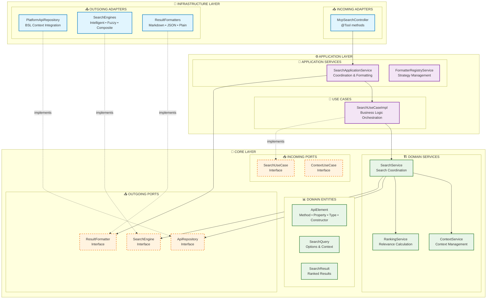
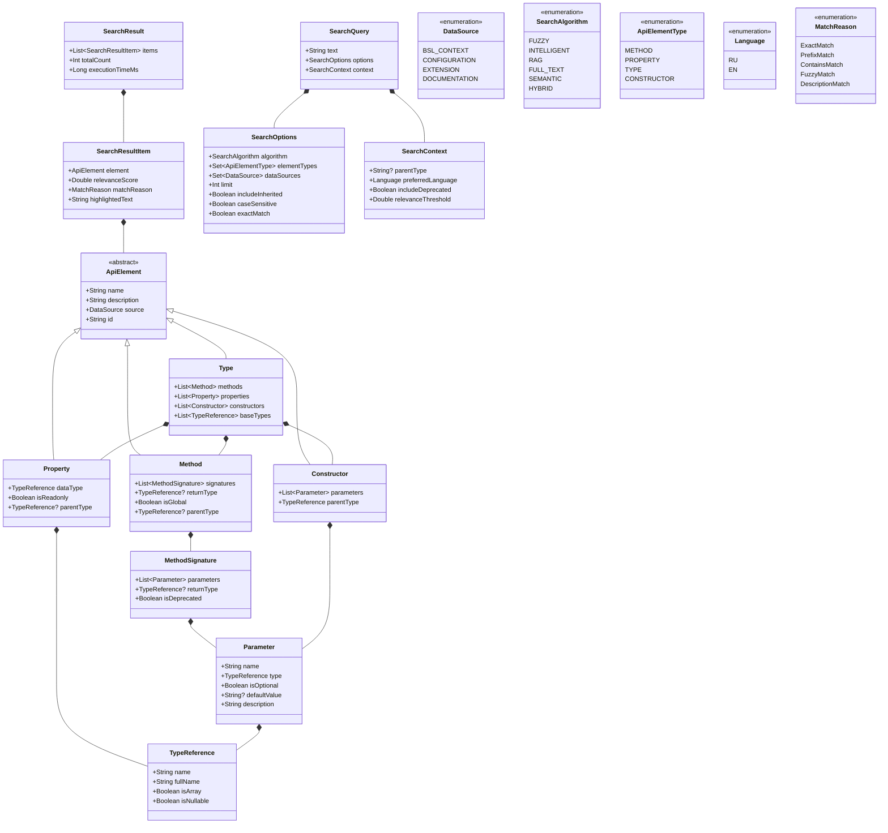
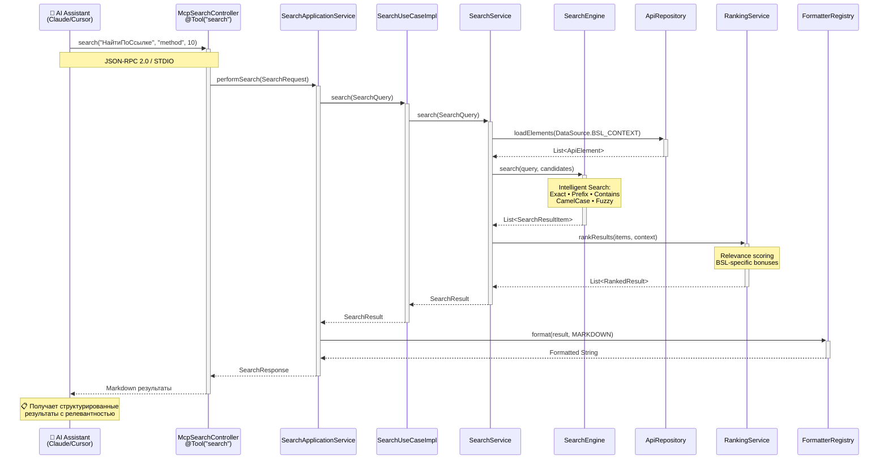
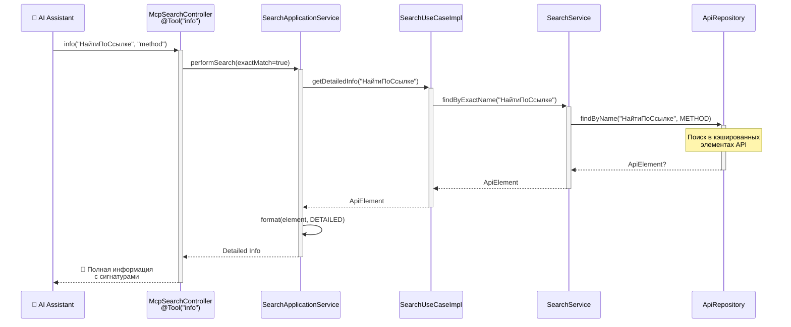
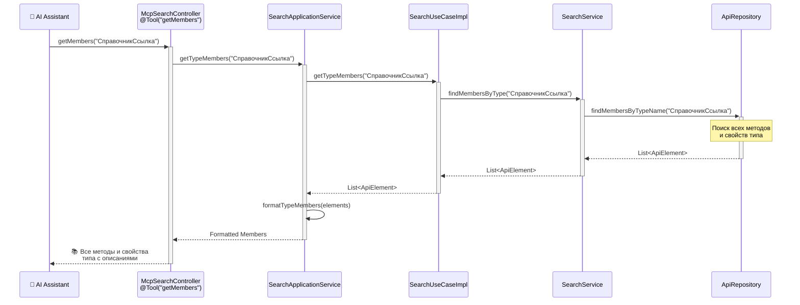
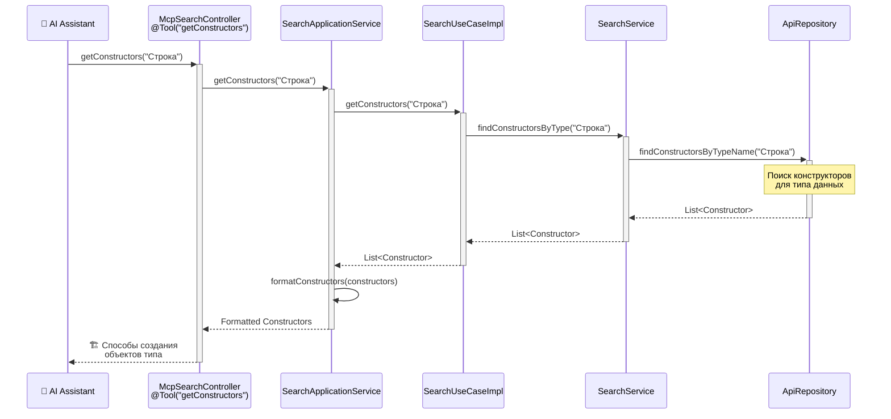
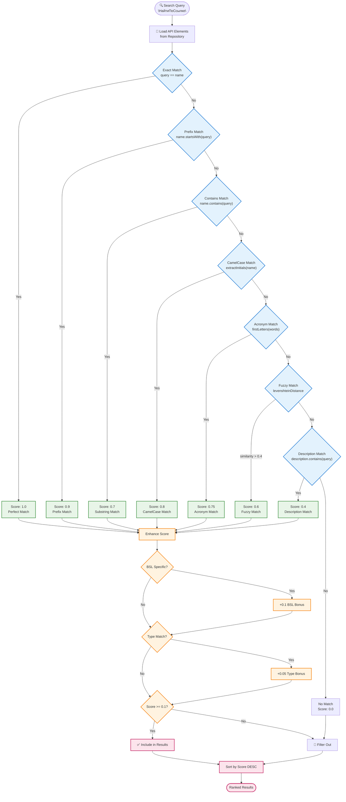

# Архитектура проекта mcp-bsl-context

## Обзор проекта

**mcp-bsl-context** - это MCP (Model Context Protocol) сервер для предоставления стандартизированного доступа к API платформы 1С Предприятие для AI ассистентов (Claude Desktop, Cursor IDE и других). Проект реализован с использованием современных принципов Clean Architecture и Hexagonal Architecture.

## Технологический стек

- **Язык:** Kotlin 2.1.20 + Java 17
- **Фреймворк:** Spring Boot 3.5.0
- **Архитектурный стиль:** Clean Architecture + Hexagonal Architecture
- **MCP Протокол:** Spring AI MCP Server 1.0.0
- **Сборка:** Gradle 8.x + Kotlin DSL
- **Сериализация:** Jackson 2.15.2 + Kotlin Module
- **Асинхронность:** Kotlin Coroutines
- **Логирование:** Logback 1.5.18 + SLF4J
- **Тестирование:** JUnit 5 + AssertJ + Spring Boot Test

## Архитектурная структура

### Схема Clean Architecture



### Файловая структура по слоям

```
src/main/kotlin/ru/alkoleft/context/
│
├── McpServerApplication.kt           # Spring Boot Entry Point
│
├── 📁 core/                         # DOMAIN LAYER (Бизнес-логика)
│   ├── 📁 domain/                   # Доменные модели
│   │   ├── api/
│   │   │   └── ApiElement.kt        # Базовая абстракция API элементов
│   │   └── search/
│   │       ├── SearchQuery.kt       # Модель поискового запроса
│   │       └── SearchResult.kt      # Модель результата поиска
│   │
│   ├── 📁 ports/                    # Интерфейсы (Порты)
│   │   ├── incoming/                # Use Cases
│   │   │   ├── SearchUseCase.kt
│   │   │   └── ContextUseCase.kt
│   │   └── outgoing/                # Репозитории и сервисы
│   │       ├── ApiRepository.kt
│   │       ├── SearchEngine.kt
│   │       └── ResultFormatter.kt
│   │
│   └── 📁 services/                 # Доменные сервисы
│       ├── SearchService.kt         # Координация поиска
│       ├── ContextService.kt        # Управление контекстом
│       └── RankingService.kt        # Ранжирование результатов
│
├── 📁 application/                  # APPLICATION LAYER (Оркестрация)
│   ├── 📁 usecases/                 # Реализации Use Cases
│   │   └── SearchUseCaseImpl.kt     # Основная бизнес-логика
│   │
│   ├── 📁 services/                 # Прикладные сервисы
│   │   ├── SearchApplicationService.kt   # Координация поиска
│   │   └── FormatterRegistryService.kt   # Управление форматтерами
│   │
│   ├── 📁 dto/                      # Data Transfer Objects
│   │   ├── SearchRequest.kt
│   │   ├── SearchResponse.kt
│   │   └── ElementInfoRequest.kt
│   │
│   └── 📁 configuration/
│       └── ApplicationConfiguration.kt
│
├── 📁 infrastructure/               # INFRASTRUCTURE LAYER (Адаптеры)
│   ├── 📁 adapters/
│   │   ├── incoming/                # Входящие адаптеры
│   │   │   └── mcp/
│   │   │       └── McpSearchController.kt  # MCP API контроллер
│   │   │
│   │   └── outgoing/                # Исходящие адаптеры
│   │       ├── repositories/
│   │       │   ├── PlatformApiRepository.kt
│   │       │   └── mappers/
│   │       │       └── DomainModelMapper.kt
│   │       │
│   │       ├── search/              # Поисковые движки
│   │       │   ├── IntelligentSearchEngine.kt
│   │       │   ├── FuzzySearchEngine.kt
│   │       │   └── CompositeSearchEngine.kt
│   │       │
│   │       └── formatters/          # Форматтеры результатов
│   │           └── MarkdownFormatter.kt
│   │
│   └── 📁 configuration/
│       └── InfrastructureConfiguration.kt
│
└── 📁 platform/                    # LEGACY INTEGRATION
    ├── 📁 dto/                     # Platform DTOs
    ├── 📁 mcp/                     # MCP Services
    ├── 📁 search/                  # Search DSL
    └── 📁 exporter/                # Platform Logic
```

## Компоненты системы

### Core Layer (Доменный слой)

#### Доменные модели (`core/domain/`)



**Ключевые особенности доменных моделей:**

**ApiElement** - Базовая sealed class для всех элементов API платформы:
- Обеспечивает type safety через sealed class
- Уникальный ID для каждого элемента
- Поддержка различных источников данных

**SearchQuery** - Типобезопасная модель поискового запроса:
- Валидация входных данных на уровне конструктора
- Конфигурируемые алгоритмы поиска
- Поддержка контекстной информации

**SearchResult** - Модель результата с метриками производительности:
- Ранжированные результаты с релевантностью
- Информация о времени выполнения
- Детали совпадений для подсветки

#### Порты (Интерфейсы) (`core/ports/`)

**Входящие порты (incoming/):**
- `SearchUseCase` - основные поисковые операции
- `ContextUseCase` - управление контекстом поиска

**Исходящие порты (outgoing/):**
- `ApiRepository` - доступ к данным API
- `SearchEngine` - алгоритмы поиска  
- `ResultFormatter` - форматирование результатов

#### Доменные сервисы (`core/services/`)

- **SearchService** - координация поисковых операций
- **ContextService** - управление контекстом платформы
- **RankingService** - алгоритмы ранжирования результатов

### Application Layer (Прикладной слой)

#### Use Cases (`application/usecases/`)

**SearchUseCaseImpl** - Главный оркестратор поисковой логики:
```kotlin
class SearchUseCaseImpl(
    private val searchService: SearchService
) : SearchUseCase {
    
    suspend fun search(query: SearchQuery): SearchResult
    suspend fun getDetailedInfo(elementId: String): ApiElement?
    suspend fun getMemberInfo(typeName: String, memberName: String): ApiElement?
    suspend fun getTypeMembers(typeName: String): List<ApiElement>
    suspend fun getConstructors(typeName: String): List<ApiElement>
}
```

#### Прикладные сервисы (`application/services/`)

- **SearchApplicationService** - координация поиска между слоями
- **FormatterRegistryService** - управление стратегиями форматирования

### Infrastructure Layer (Инфраструктурный слой)

#### Входящие адаптеры (`infrastructure/adapters/incoming/`)

**McpSearchController** - MCP API контроллер, предоставляющий 5 инструментов:

```kotlin
@Service
class McpSearchController(
    private val searchApplicationService: SearchApplicationService
) {
    
    @Tool("search")    // Поиск по API платформы
    @Tool("info")      // Детальная информация об элементе
    @Tool("getMember") // Информация о члене типа
    @Tool("getMembers")// Все члены типа
    @Tool("getConstructors") // Конструкторы типа
}
```

#### Исходящие адаптеры (`infrastructure/adapters/outgoing/`)

**Репозитории:**
- `PlatformApiRepository` - доступ к данным платформы 1С

**Поисковые движки:**
- `IntelligentSearchEngine` - интеллектуальный поиск с множественными стратегиями
- `FuzzySearchEngine` - нечеткий поиск
- `CompositeSearchEngine` - комбинированный поиск

**Форматтеры:**
- `MarkdownFormatter` - форматирование в Markdown
- Поддержка JSON, Plain Text форматтеров

## Основные Use Cases

### 1. Поиск по API платформы



### 2. Получение детальной информации



### 3. Исследование типа данных



### 4. Поиск конструкторов



## Алгоритм интеллектуального поиска

### Многоуровневая стратегия поиска



### Система ранжирования

#### Базовые веса стратегий

| Стратегия | Вес | Описание |
|-----------|-----|----------|
| **Точное совпадение** | 1.0 | Полное соответствие имени запросу |
| **Префиксное совпадение** | 0.9 | Имя начинается с запроса |
| **Содержание** | 0.7 | Имя содержит запрос |
| **CamelCase совпадение** | 0.8 | Поиск по заглавным буквам |
| **Акроним** | 0.75 | Поиск по акронимам |
| **Fuzzy поиск** | 0.6 | Нечеткое соответствие (Levenshtein) |
| **Поиск в описании** | 0.4 | Поиск в текстах описаний |

#### Бонусы и пороги

- ** BSL-специфичность**: +0.1 (для элементов, характерных для 1С)
- ** Соответствие типа**: +0.05 (точное соответствие типа элемента)
- ** Минимальный порог релевантности**: 0.1
- ** Порог fuzzy similarity**: 0.4

## Конфигурация и развертывание

### Spring Boot Configuration

```yaml
# application.yml
spring:
  ai:
    mcp:
      server:
        enabled: true
        transport: stdio
        
logging:
  level:
    ru.alkoleft.context: INFO
    org.springframework.ai: DEBUG
```

### Сборка проекта

```bash
# Сборка JAR
./gradlew bootJar

# Запуск MCP сервера
java -jar build/libs/mcp-bsl-context-*.jar \
  --platform-path="/opt/1cv8/x86_64/8.3.25.1257"
```

### Docker развертывание

```dockerfile
FROM openjdk:17-jre-slim
COPY build/libs/mcp-bsl-context-*.jar app.jar
ENTRYPOINT ["java", "-jar", "/app.jar"]
```

## Интеграция с AI клиентами

### Claude Desktop
```json
{
  "mcpServers": {
    "1c-platform": {
      "command": "java",
      "args": ["-jar", "/path/to/mcp-bsl-context.jar", 
               "--platform-path", "/opt/1cv8/x86_64/8.3.25.1257"]
    }
  }
}
```

### Cursor IDE
```json
{
  "mcpServers": {
    "1c-platform": {
      "command": "java", 
      "args": ["-jar", "/path/to/mcp-bsl-context.jar",
               "--platform-path", "/opt/1cv8/x86_64/8.3.25.1257"]
    }
  }
}
```

## Конфигурация Spring DI

### Структура конфигурации по слоям

```kotlin
// Core Configuration
@Configuration
@ComponentScan("ru.alkoleft.context.core")
class CoreConfiguration

// Application Configuration  
@Configuration
@ComponentScan("ru.alkoleft.context.application")
class ApplicationConfiguration

// Infrastructure Configuration
@Configuration
@ComponentScan("ru.alkoleft.context.infrastructure")
class InfrastructureConfiguration {
    
    @Bean
    fun compositeSearchEngine(engines: List<SearchEngine>): CompositeSearchEngine
    
    @Bean  
    fun formatterRegistry(formatters: List<ResultFormatter>): FormatterRegistryService
}
```

## Принципы взаимодействия компонентов

### Dependency Inversion Principle
- **Core слой** не зависит от Infrastructure
- **Все зависимости** через интерфейсы (порты)  
- **Infrastructure** реализует порты Core слоя

### Single Responsibility Principle
- **Каждый компонент** имеет единственную ответственность
- **Тонкие контроллеры** делегируют в Application слой
- **Application слой** оркестрирует Domain операции

### Strategy Pattern Implementation
- **SearchEngine** - различные алгоритмы поиска
- **ResultFormatter** - различные форматы вывода
- **Registry** для управления стратегиями

### Repository Pattern Implementation  
- **Абстракция** доступа к данным платформы
- **Кэширование** и оптимизация производительности
- **Thread-safe** операции

## Принципы разработки

### SOLID принципы
- **S** - Single Responsibility: каждый класс ≤ 100 LOC
- **O** - Open/Closed: расширение через стратегии без изменения кода
- **L** - Liskov Substitution: все реализации интерфейсов взаимозаменяемы
- **I** - Interface Segregation: специализированные интерфейсы
- **D** - Dependency Inversion: зависимости только от абстракций

### Design Patterns
- **Strategy Pattern** - для поисковых алгоритмов и форматтеров
- **Repository Pattern** - для доступа к данным
- **Use Case Pattern** - для бизнес-логики
- **Adapter Pattern** - для интеграции с внешними системами
- **Registry Pattern** - для управления стратегиями

### Архитектурные принципы
- **Dependency Flow**: Infrastructure → Application → Core
- **Ports & Adapters**: изоляция бизнес-логики через интерфейсы
- **Clean Architecture**: четкое разделение ответственности по слоям
- **Domain-Driven Design**: богатые доменные модели

## Тестирование

### Стратегия тестирования
- **Unit тесты**: для всех слоев архитектуры (покрытие >80%)
- **Интеграционные тесты**: для MCP tools и Spring сервисов
- **Архитектурные тесты**: валидация Clean Architecture принципов
- **E2E тесты**: полные сценарии использования MCP клиентами

### Структура тестов
```
src/test/kotlin/
├── unit/                    # Unit тесты
│   ├── core/               # Тесты доменного слоя
│   ├── application/        # Тесты прикладного слоя
│   └── infrastructure/     # Тесты инфраструктуры
├── integration/            # Интеграционные тесты
└── architecture/           # Архитектурные тесты
```

## Мониторинг и логирование

### Logback конфигурация
- Отдельная конфигурация для MCP режима
- Структурированное логирование поисковых операций
- Метрики производительности

### Spring Boot Actuator
- Health checks
- Метрики JVM
- Информация о приложении

## Планы развития

### Ближайшие улучшения
- **Полнотекстовый поиск** - семантический поиск
- **RAG поиск** - семантический поиск с векторными embeddings
- **Поддержка конфигураций** - доступ к метаданным 1С
- **Расширения** - поддержка пользовательских расширений

---

*Документация создана для проекта mcp-bsl-context v0.2.0* 