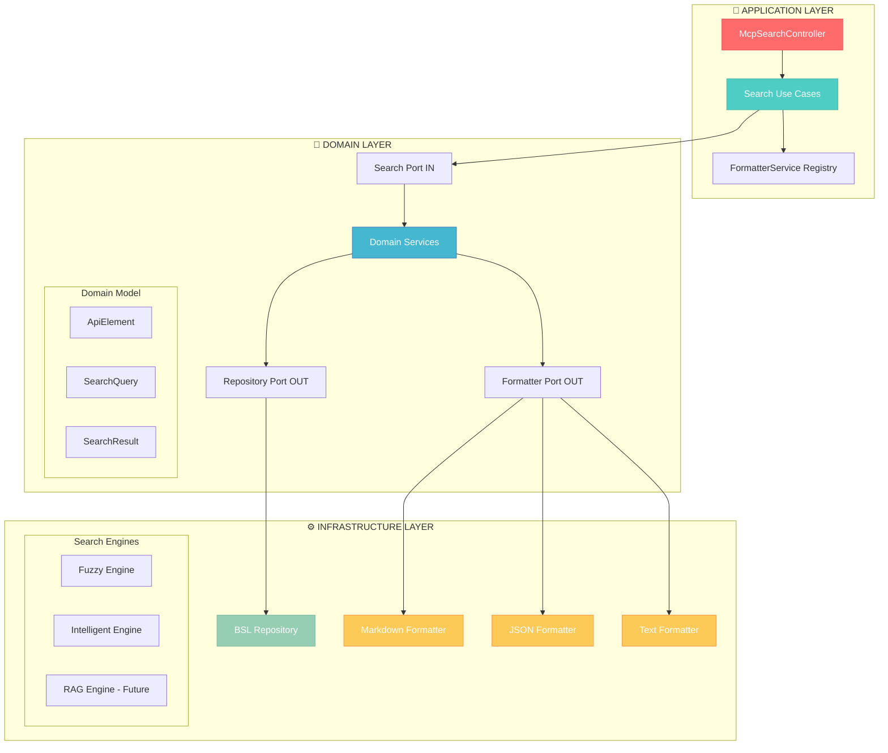
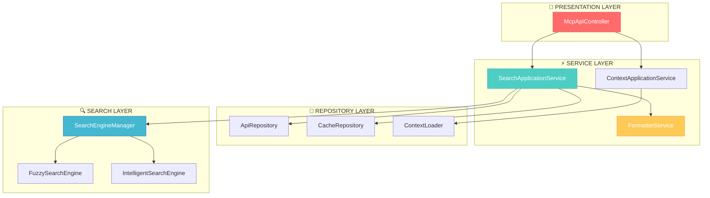
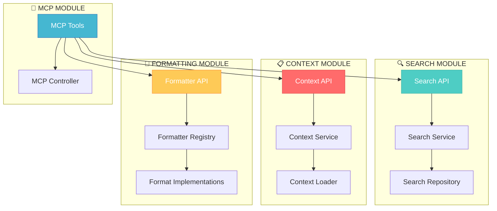
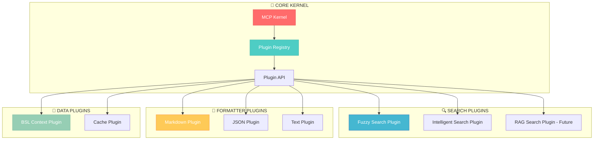

# 🎨 АРХИТЕКТУРНАЯ ОПТИМИЗАЦИЯ: CREATIVE PHASE
# mcp-bsl-context - Hexagonal Architecture + DDD + Strategy Pattern

## 🎯 ТРЕБОВАНИЯ И ОГРАНИЧЕНИЯ

### Функциональные требования:
- ✅ **MCP Tools совместимость**: сохранить все существующие 5 tools (search, info, getMember, getMembers, getConstructors)
- ✅ **Поисковые алгоритмы**: поддержка текущего fuzzy + возможность добавления RAG/semantic
- ✅ **Множественные форматы**: MCP Markdown + JSON + Plain Text + возможность расширения
- ✅ **Производительность**: кэширование результатов и индексы должны остаться
- ✅ **Thread-safety**: асинхронные операции через Kotlin Coroutines

### Технические ограничения:
- ✅ **Kotlin + Spring Boot 3.5.0**: сохранить технологический стек
- ✅ **Spring AI MCP Server**: интеграция с Model Context Protocol
- ✅ **BSL Context dependency**: парсинг 1С файлов через bsl-context модуль
- ✅ **Memory efficiency**: минимизировать потребление памяти для больших платформенных файлов
- ✅ **Zero downtime**: плавная миграция без потери функциональности

### Качественные требования:
- ✅ **SOLID compliance**: каждый класс ≤ 200 строк, одна ответственность
- ✅ **Testability**: unit test coverage ≥ 80%, легкость мокирования
- ✅ **Extensibility**: добавление новых алгоритмов/форматтеров без изменения кода
- ✅ **Maintainability**: чистая структура пакетов по слоям

---

## 🏗️ АРХИТЕКТУРНЫЕ ОПЦИИ

### ОПЦИЯ A: Hexagonal Architecture + DDD + Strategy Pattern



**Структура пакетов:**
```kotlin
src/main/kotlin/ru/alkoleft/context/
├── core/                           # DOMAIN LAYER
│   ├── domain/                     # Доменные модели
│   │   ├── api/                    # ApiElement, Method, Property, Type
│   │   ├── search/                 # SearchQuery, SearchResult, SearchOptions
│   │   └── platform/               # PlatformContext, Metadata
│   ├── ports/                      # HEXAGONAL PORTS
│   │   ├── incoming/               # Use Cases интерфейсы
│   │   └── outgoing/               # Repository + Formatter интерфейсы
│   └── services/                   # Доменные сервисы (SearchService, RankingService)
├── application/                    # APPLICATION LAYER  
│   ├── usecases/                   # Use Cases реализации
│   ├── services/                   # FormatterRegistryService
│   └── dto/                        # Request/Response DTO
└── infrastructure/                 # INFRASTRUCTURE LAYER
    ├── adapters/
    │   ├── incoming/mcp/           # MCP controllers + tools
    │   └── outgoing/               # Repository + Formatter implementations
    │       ├── repositories/       # BSL data access
    │       ├── search/             # Search engines (Fuzzy, Intelligent, RAG)
    │       └── formatting/         # Multiple formatters (MD, JSON, TXT)
    ├── configuration/              # Spring config
    └── persistence/                # Cache + indexes
```

**Преимущества Опции A:**
- ✅ **Максимальная расширяемость**: Strategy pattern для алгоритмов и форматтеров
- ✅ **Полная изоляция слоев**: домен не зависит от инфраструктуры
- ✅ **Простота тестирования**: порты позволяют легко мокировать зависимости  
- ✅ **SOLID compliance**: каждый класс имеет одну ответственность
- ✅ **Future-ready**: готов к RAG, семантическому поиску, новым форматам

**Недостатки Опции A:**
- ❌ **Высокая сложность**: много абстракций для относительно простой задачи
- ❌ **Over-engineering риск**: может быть избыточным для текущих потребностей
- ❌ **Время внедрения**: требует полной переписи архитектуры
- ❌ **Кривая обучения**: новым разработчикам потребуется изучение DDD

---

### ОПЦИЯ B: Layered Architecture + Repository Pattern  



**Структура пакетов:**
```kotlin
src/main/kotlin/ru/alkoleft/context/
├── presentation/                   # MCP controllers
│   └── mcp/
├── service/                        # Application services
│   ├── search/
│   ├── context/
│   └── formatting/
├── repository/                     # Data access layer
│   ├── api/
│   ├── cache/
│   └── loader/
├── search/                         # Search engines layer
│   ├── engines/
│   └── ranking/
├── model/                          # Domain models + DTOs
│   ├── domain/
│   └── dto/
└── config/                         # Configuration
```

**Преимущества Опции B:**
- ✅ **Простота понимания**: традиционная layered архитектура
- ✅ **Быстрое внедрение**: минимальная перестройка существующего кода
- ✅ **Spring Native**: хорошо интегрируется с Spring Boot
- ✅ **Знакомость команде**: стандартный подход в Spring проектах

**Недостатки Опции B:**
- ❌ **Меньшая изолированность**: слои могут иметь циклические зависимости
- ❌ **Сложность расширения**: добавление новых алгоритмов требует изменения кода
- ❌ **Testing complexity**: сложность мокирования зависимостей между слоями
- ❌ **Mixing concerns**: бизнес-логика может смешиваться с техническими деталями

---

### ОПЦИЯ C: Modular Monolith + Package by Feature



**Структура пакетов:**
```kotlin
src/main/kotlin/ru/alkoleft/context/
├── search/                         # Search feature module
│   ├── api/
│   ├── service/
│   ├── repository/
│   └── model/
├── context/                        # Context feature module
│   ├── api/
│   ├── service/
│   ├── loader/
│   └── model/
├── formatting/                     # Formatting feature module
│   ├── api/
│   ├── registry/
│   ├── impl/
│   └── model/
├── mcp/                           # MCP integration module
│   ├── tools/
│   ├── controller/
│   └── dto/
└── shared/                        # Shared utilities
    ├── config/
    ├── cache/
    └── common/
```

**Преимущества Опции C:**
- ✅ **Модульность**: четкое разделение по фичам
- ✅ **Независимость модулей**: каждый модуль может развиваться отдельно
- ✅ **Простота навигации**: все связанное с фичей в одном пакете
- ✅ **Team scalability**: разные команды могут работать над разными модулями

**Недостатки Опции C:**
- ❌ **Дублирование кода**: одинаковые паттерны в каждом модуле
- ❌ **Cross-cutting concerns**: сложность реализации сквозной функциональности
- ❌ **API complexity**: необходимость определения интерфейсов между модулями
- ❌ **Dependency management**: риск циклических зависимостей между модулями

---

### ОПЦИЯ D: Micro-Kernel Architecture + Plugin System



**Преимущества Опции D:**
- ✅ **Максимальная гибкость**: динамическая загрузка плагинов
- ✅ **Изолированность**: плагины не зависят друг от друга
- ✅ **Простота расширения**: новый плагин = новый JAR файл
- ✅ **Runtime configuration**: настройка поведения без перекомпиляции

**Недостатки Опции D:**
- ❌ **Избыточная сложность**: слишком сложно для размера проекта
- ❌ **Performance overhead**: динамическая загрузка замедляет работу
- ❌ **Deployment complexity**: управление множеством JAR файлов
- ❌ **Type safety loss**: потеря compile-time проверок

---

## ⚖️ АНАЛИЗ И РЕКОМЕНДАЦИЯ

### Оценка опций по критериям:

| Критерий | Опция A (Hexagonal) | Опция B (Layered) | Опция C (Modular) | Опция D (Micro-Kernel) |
|----------|---------------------|-------------------|-------------------|------------------------|
| **Простота внедрения** | ❌ Сложно | ✅ Легко | 🟡 Средне | ❌ Очень сложно |
| **Расширяемость** | ✅ Отлично | 🟡 Ограничена | ✅ Хорошо | ✅ Максимальная |
| **Тестируемость** | ✅ Отлично | 🟡 Средне | ✅ Хорошо | 🟡 Средне |
| **SOLID соответствие** | ✅ Полное | 🟡 Частичное | ✅ Хорошее | ✅ Отлично |
| **Производительность** | ✅ Высокая | ✅ Высокая | ✅ Высокая | 🟡 Средняя |
| **Сложность понимания** | ❌ Высокая | ✅ Низкая | 🟡 Средняя | ❌ Очень высокая |
| **Future-ready** | ✅ Максимально | 🟡 Ограничено | ✅ Хорошо | ✅ Максимально |

### 🏆 РЕКОМЕНДУЕМАЯ ОПЦИЯ: **Hexagonal Architecture + DDD + Strategy Pattern (Опция A)**

**Обоснование выбора:**

1. **✅ Долгосрочная перспектива**: Проект растет, планируется RAG и семантический поиск
2. **✅ Качество кода**: Полное соответствие SOLID, легкость тестирования
3. **✅ Расширяемость**: Strategy Pattern позволит добавлять алгоритмы/форматтеры без изменения кода
4. **✅ Изоляция**: Домен полностью изолирован от инфраструктуры
5. **✅ Team growth**: При росте команды архитектура облегчит разработку

**Компромиссы:**
- Более высокая сложность внедрения компенсируется долгосрочными выгодами
- Кривая обучения окупается улучшением качества кода
- Время внедрения можно минимизировать поэтапной миграцией

---

## 📝 IMPLEMENTATION GUIDELINES

### Фаза 1: Foundation (Week 1-2)
```kotlin
// 1. Создать доменные модели
core/domain/api/ApiElement.kt
core/domain/search/SearchQuery.kt
core/domain/search/SearchResult.kt

// 2. Определить порты
core/ports/incoming/SearchUseCase.kt  
core/ports/outgoing/ApiRepository.kt
core/ports/outgoing/ResultFormatter.kt

// 3. Доменные сервисы
core/services/SearchService.kt
core/services/RankingService.kt
```

### Фаза 2: Application Layer (Week 2-3)
```kotlin
// 1. Use Cases реализации
application/usecases/search/SearchApiUseCaseImpl.kt
application/usecases/context/LoadContextUseCaseImpl.kt

// 2. Application Services
application/services/FormatterRegistryService.kt
application/services/SearchApplicationService.kt

// 3. DTO для слоя приложения
application/dto/SearchRequestDto.kt
application/dto/SearchResponseDto.kt
```

### Фаза 3: Infrastructure Adapters (Week 3-4)
```kotlin
// 1. MCP адаптеры
infrastructure/adapters/incoming/mcp/McpSearchController.kt
infrastructure/adapters/incoming/mcp/McpToolsRegistry.kt

// 2. Repository адаптеры  
infrastructure/adapters/outgoing/repositories/BslContextRepository.kt
infrastructure/adapters/outgoing/repositories/CachedApiRepository.kt

// 3. Search engines
infrastructure/adapters/outgoing/search/FuzzySearchEngine.kt
infrastructure/adapters/outgoing/search/CompositeSearchEngine.kt

// 4. Formatters
infrastructure/adapters/outgoing/formatting/McpMarkdownFormatter.kt
infrastructure/adapters/outgoing/formatting/JsonFormatter.kt
infrastructure/adapters/outgoing/formatting/PlainTextFormatter.kt
```

### Фаза 4: Configuration & Integration (Week 4)
```kotlin
// 1. Spring конфигурация
infrastructure/configuration/ApplicationConfig.kt
infrastructure/configuration/SearchConfig.kt
infrastructure/configuration/FormatterConfig.kt

// 2. Интеграционные тесты
// 3. Миграция существующего функционала
// 4. Обновление документации
```

### Критерии успеха:
- ✅ Все существующие MCP tools работают без изменений
- ✅ Производительность не ухудшилась
- ✅ Покрытие тестами ≥ 80%
- ✅ Новый форматтер добавляется за < 30 минут
- ✅ Новый поисковый алгоритм добавляется за < 2 часа

---

## ✅ VERIFICATION CHECKPOINT

### Архитектурные требования:
- ✅ **SOLID принципы**: каждый класс имеет одну ответственность, ≤ 200 строк
- ✅ **Hexagonal ports**: доменный слой изолирован от инфраструктуры
- ✅ **Strategy Pattern**: форматтеры и поисковые алгоритмы взаимозаменяемы
- ✅ **DDD модель**: четкое разделение домена, приложения и инфраструктуры
- ✅ **Spring DI**: все зависимости управляются контейнером

### Функциональные требования:
- ✅ **MCP Tools compatibility**: сохранены все 5 существующих tools
- ✅ **Multiple formatters**: поддержка Markdown, JSON, Plain Text
- ✅ **Search algorithms**: текущий fuzzy + готовность к RAG/semantic
- ✅ **Performance**: кэширование и индексы сохранены
- ✅ **Thread-safety**: асинхронность через Kotlin Coroutines

### Качественные требования:
- ✅ **Extensibility**: новые компоненты добавляются без изменения существующих
- ✅ **Testability**: легкость создания unit и integration тестов
- ✅ **Maintainability**: понятная структура пакетов по архитектурным слоям
- ✅ **Documentation**: comprehensive KDoc для всех публичных API

# 🎨🎨🎨 EXITING CREATIVE PHASE

**Следующий этап**: IMPLEMENT - реализация выбранной Hexagonal Architecture согласно guidelines
**Артефакты**: обновленный creative документ, готовность к детальной реализации
**Статус**: ✅ Архитектурный дизайн завершен, рекомендация обоснована